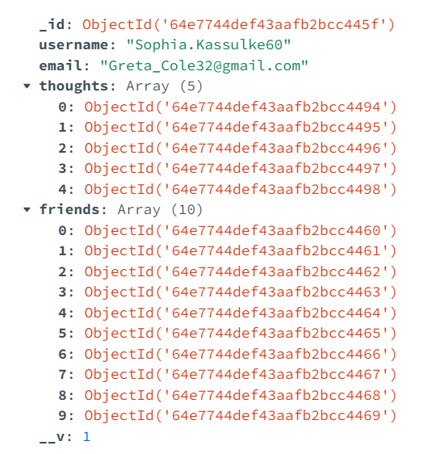
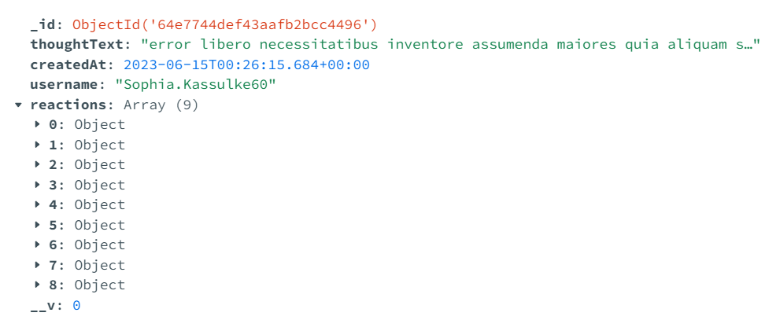
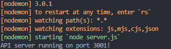
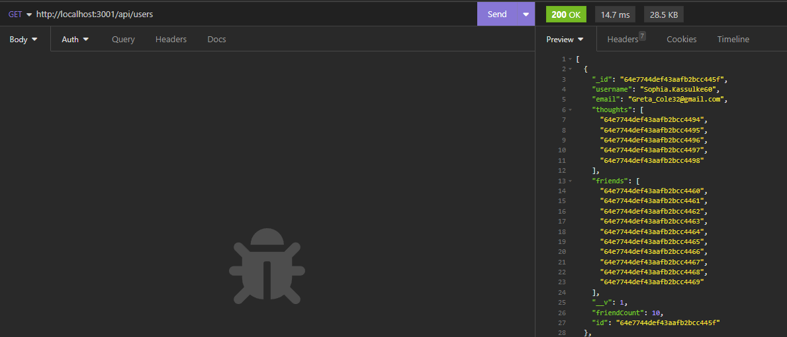

# Social Media NoSQL Backend

## Description

This was a assignment where the ask was to create a low tier backend server for a social media website. This application allows for the generation of users, posts (thoughts), and reactions from other users to be stored to a NoSQL database using Mongo DB and the Mongoose ODM. This application also uses Faker.js to seed simulated user data for testing and demonstration purposes, and Express.js for routing. This application closely follows MVC paradigm but lacks views / front end.

Installation instruction video and demo: [Link to video.](https://drive.google.com/file/d/1rtElGbuZ2P4q31N0mL_9zkfEUGzNIq1m/view)

Node can be installed directly from [https://nodejs.org/en](https://nodejs.org/en).

MongoDB can be installed directly from [https://www.mongodb.com/docs/manual/tutorial/install-mongodb-on-windows/](https://www.mongodb.com/docs/manual/tutorial/install-mongodb-on-windows/)

All other node packages can be installed by using "npm install" from command-line when in the applications root directory.

Seeding is handled automatically as a post install script or can be ran via "npm run seed" from CLI.

This was a project during the Full Stack Web Development Bootcamp at UC Berkeley Ext.

Example of Users Collection Document:



Example of Thoughts Collection Document:



#### Database Running from CLI:



#### Example of a GET Response:



## Installation

For Development:

Installation video: [https://drive.google.com/file/d/1rtElGbuZ2P4q31N0mL_9zkfEUGzNIq1m/view](https://drive.google.com/file/d/1rtElGbuZ2P4q31N0mL_9zkfEUGzNIq1m/view)

1. Clone or fork the repository from "git@github.com:MeanBean87/nosql-backend.git"
2. Navigate to the root directory of the project using CLI.
3. Open in the code editor of your choice. ie vs-code - optional.
4. Install node modules using "npm install" in either CLI or integrated terminal - vs code.
5. Start the server with "npm start" or "npm run dev" - uses nodemon.

**Mongo DB and Node.js will need to be installed by the user before installing Node dependencies.**

Node can be installed directly from [https://nodejs.org/en](https://nodejs.org/en).

MongoDB can be installed directly from [https://www.mongodb.com/docs/manual/tutorial/install-mongodb-on-windows/](https://www.mongodb.com/docs/manual/tutorial/install-mongodb-on-windows/)

## Usage

### API Routes

**`/api/users`**

* `GET` Returns all users.
* `POST` Creates a new user, minimum body needed to be passed:

```json
{
  "username": "MurphyRipley",
  "email": "themurph@gmail.com"
}
```

**`/api/users/:id`**

* `GET` Returns a single user by its `_id` and populated thought and friend data.
* `PUT` Update a user by its `_id` example body:

```json
{
  "username": "MurphyRipley1241",
  "email": "themurphsnew@gmail.com"
}
```

* `DELETE` Removes user by its `_id` and drops the user's associated thoughts.

**`/api/users/:userId/friends/:friendId`**

* `POST` Adds a new friend by `_id` to a user's friend list by `_id`.
* `DELETE` Removes a friend from a user's friend list.

**`/api/thoughts`**

* `GET` to get all thoughts
* `POST` to create a new thought (don't forget to push the created thought's `_id` to the associated user's `thoughts` array field)

```json
{
  "thoughtText": "Here's a cool thought...",
  "username": "lernantino",
  "userId": "5edff358a0fcb779aa7b118b"
}
```

**`/api/thoughts/:id`**

* `GET` Returns a single thought by its `_id`.
* `PUT` Updates a thought by its `_id`.
* `DELETE` Deletes a thought by its `_id.`

**`/api/thoughts/:thoughtId/reactions`**

* `POST` Creates a reaction stored in a single thought's `reactions` array field. Example body:

```json
{
  "reactionBody": "I could go for some fried rice!",
  "username": "the_original_murphy",
}
```

**`/api/thoughts/:thoughtId/reactions/:reactionId`**

* `DELETE` Removes a reaction by the reaction's `reactionId` value.

Mozilla Developer Network for HTTP Request Methods:

[https://developer.mozilla.org/en-US/docs/Web/HTTP/Methods](https://developer.mozilla.org/en-US/docs/Web/HTTP/Methods)

## Code Highlights

#### Users Schema:

```javascript
const { Schema, model } = require("mongoose");

const UserSchema = new Schema(
  {
    username: { type: String, required: true, unique: true, trim: true },
    email: {
      type: String,
      required: true,
      unique: true,
      validate: {
        validator: function (value) {
          return /^([A-Za-z0-9_\.-]+)@([\dA-Za-z\.-]+).([A-Za-z\.]{2,6})$/.test(
            value
          );
        },
        message: "Invalid Email Format.",
      },
    },
    thoughts: [{ type: Schema.Types.ObjectId, ref: "Thought" }],
    friends: [{ type: Schema.Types.ObjectId, ref: "User" }],
  },
  {
    toJSON: { virtuals: true, getters: true },
  }
);

UserSchema.virtual("friendCount").get(function () {
  return this.friends.length;
});

const User = model("User", UserSchema);

module.exports = { User };

```

#### Thoughts Schema:

```javascript
const { Schema, model } = require("mongoose");
const { formatDate } = require("../utils/formatDate");

const ReactionSchema = new Schema({
  reactionId: {
    type: Schema.Types.ObjectId,
    default: () => new Types.ObjectId(),
  },
  reactionBody: {
    type: String,
    required: true,
    maxLength: 280,
  },
  username: {
    type: String,
    required: true,
  },
  createdAt: {
    type: Date,
    get: (createdAtVal) => formatDate(createdAtVal),
    default: Date.now,
  },
},
{
  toJSON: { getters: true, virtuals: true },
}
);

const ThoughtSchema = new Schema(
  {
    thoughtText: {
      type: String,
      required: true,
      minLength: 1,
      maxLength: 280,
    },
    createdAt: {
      type: Date,
      get: (createdAtVal) => formatDate(createdAtVal),
      default: Date.now,
    },
    username: {
      type: String,
      required: true,
    },
    reactions: [ReactionSchema],
  },
  {
    toJSON: { getters: true, virtuals: true },
  }
);

ThoughtSchema.virtual("reactionCount").get(function () {
  return this.reactions.length;
});

const Thought = model("Thought", ThoughtSchema);

module.exports = { Thought };

```

## Learning Points

Using MongoDB with Mongoose ODM to perform CRUD operations.

## Badges

[](https://img.shields.io/badge/Node%20js-339933?style=for-the-badge&logo=nodedotjs&logoColor=white) [](https://img.shields.io/badge/JavaScript-323330?style=for-the-badge&logo=javascript&logoColor=F7DF1E) [](https://img.shields.io/badge/MongoDB-4EA94B?style=for-the-badge&logo=mongodb&logoColor=white) [](https://www.npmjs.com/package/mongoose) [](https://opensource.org/licenses/MIT) [](https://github.com/Marak/faker.js)

## Author

Michael Mattingly

* [GitHub](https://github.com/MeanBean87)
* [LinkedIn](https://www.linkedin.com/in/michael-mattingly-5580b1280/)

This project was created with source code provided from UC Berkeley Extension.

This project uses the following packages:

* Node.js - [https://nodejs.org/en](https://nodejs.org/en)
* Express - [http://expressjs.com/](http://expressjs.com/)
* MongoDB - [https://www.mongodb.com/](https://www.mongodb.com/)
* Mongoose - [https://mongoosejs.com/](https://mongoosejs.com/)
* Faker - [https://fakerjs.dev/](https://fakerjs.dev/)

## License

This project is licensed under the [MIT License](https://github.com/MeanBean87/readme-generator/blob/main/LICENSE). Please refer to the LICENSE file for more details.
